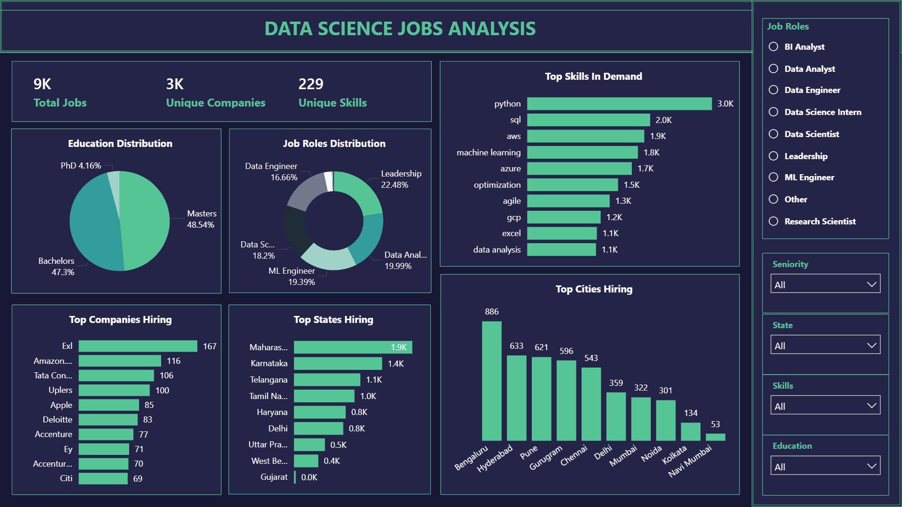

<div align="center">

  <h1>Data Science Jobs Market Analysis — India 2025</h1>

  <p><strong>An end-to-end labour-market analysis built on 9,000+ Data Science job postings scraped from LinkedIn and Indeed — surfacing which skills, cities, industries, and experience bands actually dominate hiring in India today.</strong></p>

  <p>
    
    
    
    
    
    
  </p>

</div>

---

## Why This Project

Every aspiring data scientist asks the same questions: *Which skills should I learn first? Which cities have the most openings? What experience do employers actually expect?* The standard answers come from listicles and LinkedIn opinion posts — opinion-shaped, not data-shaped.

This project answers them with data. A custom scraper pulls 9K+ live Data Science postings from LinkedIn and Indeed, the dataset is cleaned and modelled into a star schema, and Power BI surfaces the signal: which skills appear in postings, where hiring is concentrated, what experience and education bands dominate, and which industries are doing the hiring. Everything is reproducible — the scraper runs in Docker, the cleaning pipeline lives in a notebook, and the dashboard reads from a clean fact table.

> **Guiding question:** *What does the Data Science job market in India look like in 2025, and how can job seekers align themselves with market demand?*

---

## Dashboard Preview



A single-page interactive dashboard with KPIs, top-skill ranking, geographic distribution, role/experience/education breakdowns, and slicers for live filtering by role, seniority, state, skills, and education.

---

## Headline Findings

| # | Finding | What it implies |
|---|---------|-----------------|
| 1 | **Communication is the most-demanded skill** — ranking above any technical tool | Soft skills aren't a tiebreaker; they're a baseline. Portfolios need to *communicate* findings, not just produce them |
| 2 | **Python, SQL, AWS, ML form the technical core** | These four cover the floor for most postings; specialise *after* you have all four, not before |
| 3 | **Bengaluru, Hyderabad, Pune dominate hiring** | Remote-first thinking still loses to relocation-friendly thinking in the Indian DS market |
| 4 | **3–7 years experience is the modal range** | The market is mid-level-heavy; entry-level and senior roles are both thinner than people assume |
| 5 | **Masters preferred for senior roles, Bachelors fine for mid-level** | The "do I need a Masters?" question has a tier-dependent answer, not a universal one |

**Snapshot:** 9K+ postings · 3K+ unique companies · 229 distinct skills tracked · Technology, Consulting, and Finance lead the industry mix.

---

## Architecture

```
┌──────────────────────────────────────────────────────────────────┐
│                     SCRAPING LAYER                                │
│  scraper/job_scraper.py  +  JobSpy Docker API                     │
│  → data/jobs_raw.csv     (LinkedIn + Indeed, India-wide)          │
└───────────────────────────┬──────────────────────────────────────┘
                            ▼
┌──────────────────────────────────────────────────────────────────┐
│                  CLEANING & EDA LAYER                             │
│  notebook/EDA.ipynb       (pandas, regex skill extraction)        │
│  → data/jobs_cleaned.csv  (deduped, standardised, enriched)       │
└───────────────────────────┬──────────────────────────────────────┘
                            ▼
          ┌─────────────────┴──────────────────┐
          ▼                                     ▼
┌──────────────────┐                 ┌─────────────────────────────┐
│   EXCEL LAYER    │                 │       MODELLING LAYER        │
│                  │                 │  Power BI star schema        │
│  Pivot tables    │                 │  Fact: jobs                  │
│  for validation  │                 │  Dims: skills, companies,    │
│  + dimension     │                 │  cities, states, roles,      │
│  table export    │                 │  education, experience,      │
│                  │                 │  industries + bridge tables  │
└──────────────────┘                 └──────────────┬──────────────┘
                                                    ▼
                                     ┌─────────────────────────────┐
                                     │     DASHBOARD LAYER          │
                                     │  data-science-jobs-analytics │
                                     │  .pbix — KPIs, top-N visuals,│
                                     │  geographic & role filters   │
                                     └─────────────────────────────┘
```

**Design choices worth calling out:**

- **Scraper containerised via Docker.** JobSpy runs as a service the scraper hits over HTTP — clean separation between the scraping engine and the orchestration script. Re-running on a different machine is `docker compose up`, not a dependency hunt.
- **Bridge table for skills.** Skills are many-to-many with jobs (one posting has multiple skills; one skill appears in many postings). Modelled correctly with a `jobs_skills` bridge instead of comma-stuffing a single column — which is what makes Top-N skill ranking actually work in DAX.
- **Excel as a validation layer, not a destination.** Pivot tables were used to sanity-check distributions before they hit Power BI. If pivot counts disagreed with model counts, the model was wrong. This catches schema mistakes early.

---

## Methodology

### 1. Scraping (Python + Docker)

A custom scraper (`job_scraper.py`) hits the JobSpy Docker API to pull postings from LinkedIn and Indeed across India. Fields extracted:

`job title` · `company` · `description` · `city` · `state` · `skills` · `education` · `experience` · `seniority` · `job type` · `posted date` · `industry`

Raw output → `data/jobs_raw.csv`.

### 2. Cleaning & EDA (Jupyter)

Performed in `notebook/EDA.ipynb`:

- Deduplicated postings (same title + company + city collapses)
- Standardised job titles, cities, and states (case, punctuation, abbreviations)
- Extracted structured skills from free-text descriptions using regex against a 229-skill dictionary
- Cleaned education and experience fields into ordinal bands
- Derived role categories and per-posting skill counts

Cleaned output → `data/jobs_cleaned.csv`.

### 3. Excel Pivot Validation

Pivot tables in `ds-jobs-analysis.xlsx` were used to validate distributions and export dimension tables before Power BI modelling:

| Pivot | Purpose |
|-------|---------|
| Top States Hiring | Posting count by state |
| Top Cities Hiring | Hiring hotspot identification |
| Top Companies | Companies with highest hiring volume |
| Top Skills | Skill frequency across all postings |
| Job Roles Distribution | Count by role (Data Analyst, ML Engineer, etc.) |
| Education Requirement | Masters vs Bachelors vs PhD breakdown |
| Experience Required | 0–12 year distribution |

### 4. Power BI Modelling

A clean star schema:

- **Fact:** `jobs` (one row per posting)
- **Dimensions:** `skills`, `companies`, `cities`, `states`, `job_roles`, `education`, `experience`, `industries`
- **Bridge:** `jobs_skills` (many-to-many resolution between jobs and skills)

### 5. Dashboard

KPIs (Total Jobs · Unique Companies · Unique Skills) on top, with visuals for top skills, geographic concentration, role distribution, education/experience requirements, and top hiring companies. Filters: role, seniority, state, skills, education.

---

## Recommendations

### For job seekers

1. **Cover the floor before specialising** — Python + SQL + ML + one cloud (AWS or Azure) appears in the majority of postings; deep specialism only pays off after that
2. **Build end-to-end projects, not notebooks** — postings emphasise production workflow language, not Kaggle accuracy
3. **Treat communication as a hard skill** — the data is unambiguous; it's the most-mentioned skill, full stop
4. **Concentrate the job search on Bengaluru, Hyderabad, Pune** — three cities account for the bulk of postings; broad national searches dilute effort
5. **Pursue a Masters only if targeting senior roles** — mid-level roles do not require it; entry-to-mid candidates over-optimise for a credential that won't be checked

### For organisations

- Audit job posting clarity against market norms — vague skill requirements correlate with longer time-to-fill
- Benchmark experience and education bands against the distribution to avoid over-specifying
- Use industry-mix data to identify where you're competing for talent, not just hiring it

---

## Skills Demonstrated

| Tool | Skills |
|------|--------|
| **Python** | Web scraping · Docker API integration · Regex-based skill extraction · Cleansing & preprocessing |
| **Excel** | Pivot tables · Slicer-based filtering · Data validation · Aggregation |
| **Power BI** | Star-schema modelling · Bridge tables for many-to-many · DAX measures · Top-N ranking · Interactive visual design |

---

## Repository Structure

```
data-science-jobs-analysis/
├── data/
│   ├── jobs_raw.csv                        # Scraper output
│   └── jobs_cleaned.csv                    # Post-EDA, dashboard-ready
├── scraper/
│   ├── job_scraper.py                      # Main scraper script
│   ├── docker-compose.yml                  # JobSpy API container
│   └── docker-image-starter-cmd            # Setup commands
├── notebook/
│   └── EDA.ipynb                           # Cleaning + exploratory analysis
├── ds-jobs-analysis.xlsx                   # Pivot validation + dimension export
├── data-science-jobs-analytics.pbix        # Power BI dashboard
├── screenshots/
│   └── screenshot.png
├── requirements.txt
└── README.md
```

---

## Run It

```bash
# 1. Start the JobSpy scraper container
cd scraper
docker compose up -d

# 2. Run the scraper (pulls fresh postings)
pip install -r ../requirements.txt
python job_scraper.py

# 3. Clean and explore
jupyter lab ../notebook/EDA.ipynb

# 4. Open the dashboard
# data-science-jobs-analytics.pbix in Power BI Desktop
```

---

## Next Steps

Natural extensions if this becomes a longer-running project:

- **Daily scraping automation** — cron + GitHub Actions for a continuously refreshed dataset
- **Time-series layer** — track how skill demand shifts week-over-week (Prophet or ARIMA)
- **NLP on job descriptions** — topic modelling, keyword extraction, sentiment of description tone
- **Public deployment** — Streamlit search interface or Power BI service publish, so other job seekers can use it
- **Salary enrichment** — join with Glassdoor / AmbitionBox where available

---

## Author

**Alok Deep** — Building toward data science roles in Bengaluru. This project is partly a market-analysis exercise and partly a self-targeting tool — the same data informs my own learning roadmap.

[LinkedIn](#) · [Portfolio](#) · [Email](#)
